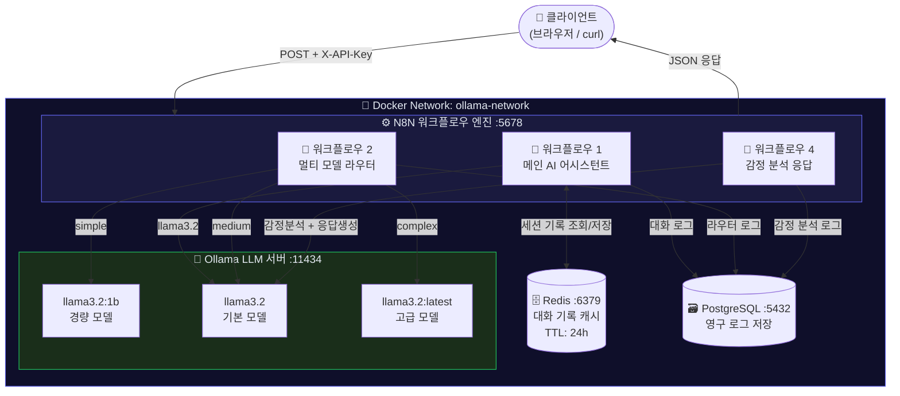
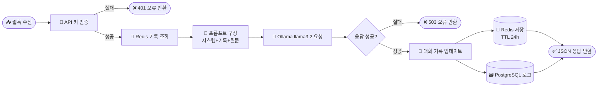
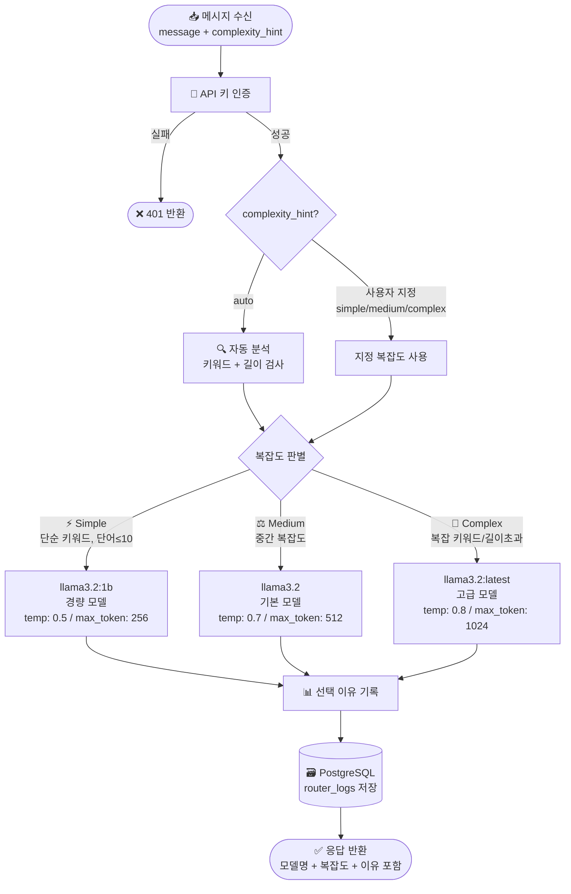
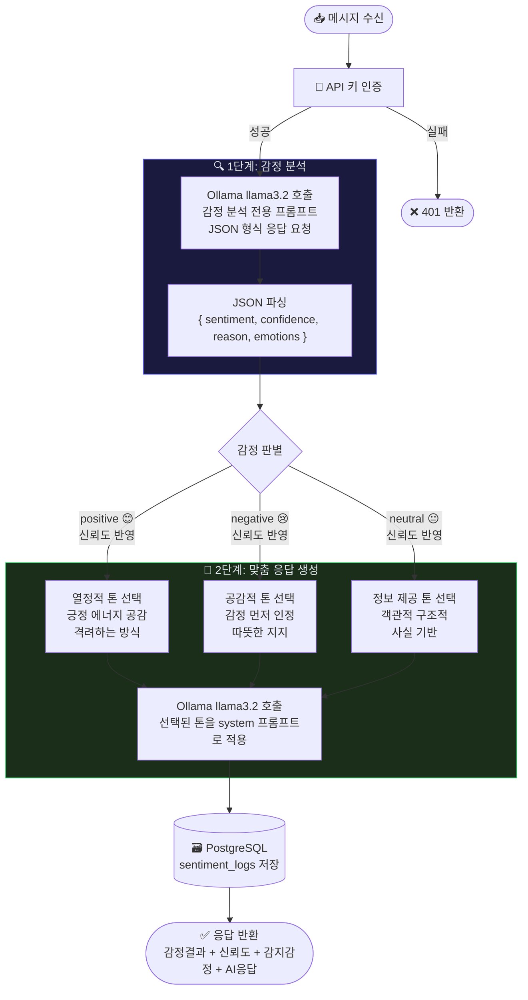
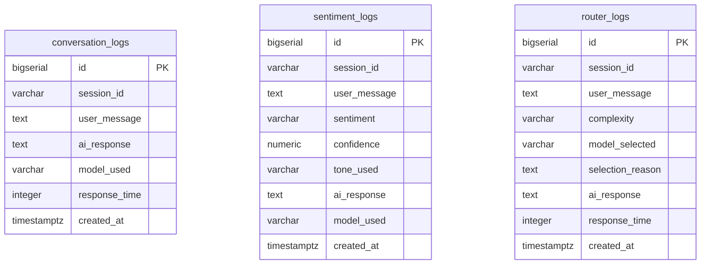
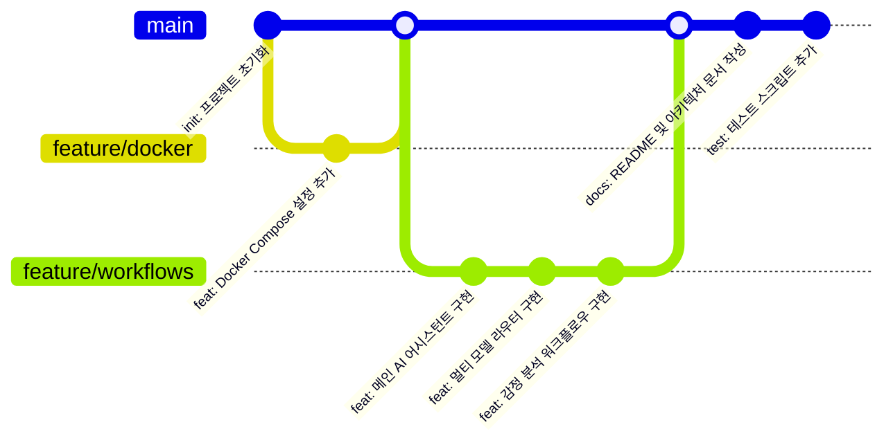
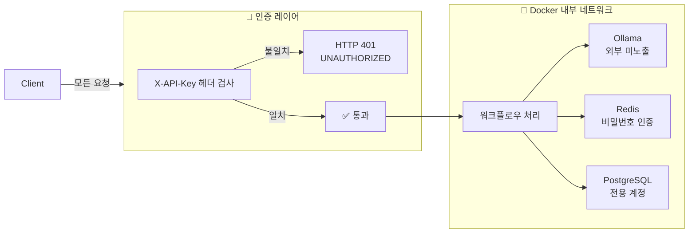

# 🤖 Local AI Platform — 프로젝트 설명서

> N8N 워크플로우 자동화 + Ollama 로컬 LLM + Docker 통합 플랫폼

---

## 1. 프로젝트 개요

본 프로젝트는 **오픈소스만으로 구성된 완전한 로컬 AI 자동화 플랫폼**입니다.  
외부 AI API(OpenAI 등) 없이 로컬에서 LLM을 실행하며, N8N 워크플로우로 AI 로직을 자동화합니다.

### 핵심 구성 요소

| 구성 요소 | 기술 스택 | 역할 |
|----------|-----------|------|
| 워크플로우 엔진 | N8N | API 요청 수신, 로직 처리, 응답 반환 |
| LLM 추론 서버 | Ollama + llama3.2 | 자연어 처리 및 응답 생성 |
| 세션 캐시 | Redis | 대화 기록 임시 저장 (TTL 24h) |
| 영구 저장소 | PostgreSQL | 대화 로그, 감정 분석 결과 저장 |
| 컨테이너 | Docker Compose | 전체 스택 단일 명령 실행 |
| 데모 UI | HTML/JS | 브라우저 기반 시각화 인터페이스 |

### 제공 워크플로우 3종

```
┌─────────────────────────────────────────────────────────┐
│  워크플로우 1  │  메인 AI 어시스턴트   │ /webhook/ai-assistant      │
│  워크플로우 2  │  멀티 모델 라우터     │ /webhook/model-router      │
│  워크플로우 4  │  감정 분석 및 맞춤 응답│ /webhook/sentiment-response│
└─────────────────────────────────────────────────────────┘
```

---

## 2. 전체 시스템 아키텍처



---

## 3. 워크플로우 1 — 메인 AI 어시스턴트

### 설명

사용자 메시지를 받아 Redis에서 이전 대화 기록을 불러오고,  
Ollama(llama3.2)로 컨텍스트 인식 응답을 생성한 뒤 기록을 업데이트합니다.  
모든 대화는 PostgreSQL에 영구 저장됩니다.

### 처리 흐름 (시퀀스 다이어그램)

```mermaid
sequenceDiagram
    actor C as 👤 클라이언트
    participant N as ⚙️ N8N
    participant R as 🗄️ Redis
    participant O as 🧠 Ollama
    participant P as 🗃️ PostgreSQL

    C->>N: POST /webhook/ai-assistant<br/>{ message, session_id }<br/>헤더: X-API-Key

    rect rgb(30, 30, 60)
        Note over N: 🔐 API 키 인증 검증
        Note over N: ✅ 입력값 유효성 검사
    end

    N->>R: GET conversation:{session_id}
    R-->>N: 이전 대화 기록 배열

    rect rgb(20, 40, 20)
        Note over N: 📝 시스템 프롬프트 + 기록 + 새 메시지 조합
    end

    N->>O: POST /api/chat<br/>{ model: llama3.2, messages: [...] }
    Note over O: ⏳ LLM 추론 처리
    O-->>N: { message: { content: "AI 응답" } }

    par 병렬 저장
        N->>R: SET conversation:{session_id}<br/>(TTL: 86400초)
    and
        N->>P: INSERT INTO conversation_logs
    end

    N-->>C: HTTP 200<br/>{ success, data.message,<br/>metadata.model, metadata.responseTime }
```



### 블록 다이어그램



---

## 4. 워크플로우 2 — 멀티 모델 라우터

### 설명

메시지의 복잡도를 자동으로 분석하여 가장 적합한 LLM 모델로 라우팅합니다.  
키워드와 텍스트 길이를 기반으로 Simple / Medium / Complex를 판별합니다.

### 복잡도 분류 기준

| 등급 | 조건 | 할당 모델 | 특징 |
|------|------|----------|------|
| ⚡ Simple | 단순 키워드 포함 AND 단어 수 ≤ 10 | llama3.2:1b | 빠른 응답, 낮은 메모리 |
| ⚖️ Medium | Simple/Complex 기준 미해당 | llama3.2 | 균형 잡힌 성능 |
| 🧠 Complex | 복잡 키워드 OR 단어 수 > 50 OR 글자 수 > 300 | llama3.2:latest | 심층 분석, 포괄적 응답 |

### 라우팅 블록 다이어그램



---

## 5. 워크플로우 4 — 감정 분석 및 맞춤 응답

### 설명

사용자 메시지의 감정을 먼저 분석(1차 LLM 호출)한 뒤,  
감정에 맞는 톤의 시스템 프롬프트를 적용하여 최종 응답을 생성(2차 LLM 호출)합니다.

### 감정별 응답 전략

| 감정 | 이모지 | 톤 | 특징 |
|------|--------|-----|------|
| positive | 😊 | 열정적 톤 | 긍정 에너지 공감, 격려, 활기찬 표현 |
| negative | 😢 | 공감적 톤 | 감정 인정, 판단 없는 따뜻한 지지 |
| neutral | 😐 | 정보 제공 톤 | 객관적, 구조적, 사실 기반 |

### 2단계 처리 블록 다이어그램



---

## 6. 데이터베이스 스키마



---

## 7. Git 커밋 이력



---

## 8. 실행 방법

### 전체 스택 시작

```bash
git clone https://github.com/Userlsj-project/local-ai-platform.git
cd local-ai-platform

# 환경 변수 설정
cp .env.example .env  # 값 수정 후 저장

# Docker 서비스 시작
docker compose up -d

# Ollama 모델 다운로드
docker exec n8n_ollama ollama pull llama3.2
docker exec n8n_ollama ollama pull llama3.2:1b
```

### API 호출 예시

```bash
# 워크플로우 1: 메인 AI 어시스턴트
curl -X POST http://localhost:5678/webhook/ai-assistant \
  -H "Content-Type: application/json" \
  -H "X-API-Key: n8n-ollama-api-key-2024" \
  -d '{"message": "안녕하세요!", "session_id": "my_session"}'

# 워크플로우 2: 멀티 모델 라우터
curl -X POST http://localhost:5678/webhook/model-router \
  -H "Content-Type: application/json" \
  -H "X-API-Key: n8n-ollama-api-key-2024" \
  -d '{"message": "도커란 무엇인가요?", "complexity_hint": "auto"}'

# 워크플로우 4: 감정 분석
curl -X POST http://localhost:5678/webhook/sentiment-response \
  -H "Content-Type: application/json" \
  -H "X-API-Key: n8n-ollama-api-key-2024" \
  -d '{"message": "오늘 발표가 잘 됐어요! 정말 기뻐요!"}'
```

### 웹 데모 실행

```bash
cd docs
python3 -m http.server 8080
# 브라우저에서 http://localhost:8080/demo.html 접속
```

---

## 9. 보안 구조



| 보안 항목 | 적용 방법 |
|----------|-----------|
| API 인증 | 모든 웹훅에 `X-API-Key` 헤더 필수 |
| 네트워크 격리 | Docker 브리지 네트워크로 내부 서비스 격리 |
| 민감 정보 | `.env` 파일 분리, `.gitignore`로 Git 제외 |
| Redis 보안 | `requirepass` 설정 |
| PostgreSQL | 전용 사용자/비밀번호, 일반 계정 미사용 |

---

*N8N-Ollama Local AI Platform — 오픈소스 기반 로컬 AI 자동화 솔루션*
