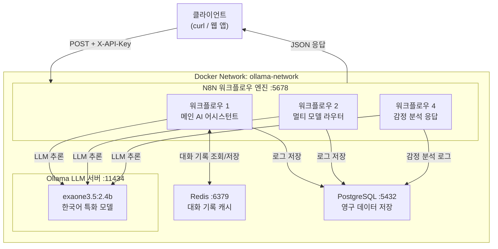

# N8N-Ollama AI 자동화 플랫폼

> Docker 기반 N8N 워크플로우 자동화와 Ollama 로컬 LLM을 통합한 AI 플랫폼
> **사용 모델: EXAONE 3.5 2.4B (LG AI Research) — 비상업적 용도 전용**

---

> **라이선스 안내**
> 이 프로젝트는 EXAONE 3.5 모델을 사용합니다.
> 해당 모델은 비상업적 용도로만 사용 가능합니다.
> (EXAONE AI Model License 1.1 - NC)
> 자세한 내용: https://huggingface.co/LGAI-EXAONE/EXAONE-3.5-2.4B-Instruct

---

## 목차

1. [프로젝트 개요](#프로젝트-개요)
2. [시스템 구성](#시스템-구성)
3. [빠른 시작](#빠른-시작)
4. [워크플로우 사용법](#워크플로우-사용법)
5. [환경 변수 설명](#환경-변수-설명)
6. [N8N 자격증명 설정](#n8n-자격증명-설정)
7. [문제 해결 가이드](#문제-해결-가이드)
8. [프로젝트 구조](#프로젝트-구조)

---

## 프로젝트 개요

N8N-Ollama 플랫폼은 **N8N + Ollama + PostgreSQL + Redis** 4개 서비스를 Docker로 구성한 로컬 AI 자동화 플랫폼입니다.
한국어에 특화된 **EXAONE 3.5 2.4B** 모델을 사용하여 한국어 대화 품질을 높였습니다.

| 번호 | 워크플로우 이름        | 설명                                            | 엔드포인트                    |
|------|----------------------|------------------------------------------------|-------------------------------|
| 1    | 메인 AI 어시스턴트    | Redis 대화 기록 + PostgreSQL 로그 + Ollama 대화  | `/webhook/ai-assistant`       |
| 2    | 멀티 모델 라우터      | 메시지 복잡도에 따른 자동 모델 선택 라우팅        | `/webhook/model-router`       |
| 4    | 감정 분석 및 맞춤 응답 | 감정 감지 후 맞춤 톤으로 응답 생성              | `/webhook/sentiment-response` |

### 핵심 특징

- **완전한 Docker 구성**: `docker compose up -d` 한 명령으로 전체 스택 시작
- **한국어 특화 모델**: EXAONE 3.5 2.4B — LG AI Research 개발, 한국어 성능 최적화
- **경량 운영**: 2.4B 파라미터, ~1.6GB — 일반 노트북(16GB RAM)에서도 동작
- **API 키 인증**: 모든 웹훅에 `X-API-Key` 헤더 필수
- **세션 관리**: Redis로 대화 기록 유지, 24시간 TTL
- **데이터 영속성**: PostgreSQL에 모든 대화/분석 이력 저장

---

## 시스템 구성

### 서비스 구성표

| 서비스     | 이미지                | 포트  | 역할                        |
|-----------|-----------------------|-------|-----------------------------|
| N8N       | n8nio/n8n:latest      | 5678  | 워크플로우 자동화 엔진        |
| Ollama    | ollama/ollama:latest  | 11434 | 로컬 LLM 추론 서버           |
| Redis     | redis:7-alpine        | 6379  | 세션 캐시 및 대화 기록        |
| PostgreSQL| postgres:16-alpine    | 5432  | 영구 데이터 저장              |

### 시스템 아키텍처 다이어그램



더 상세한 다이어그램은 [docs/ARCHITECTURE_DIAGRAM.md](docs/ARCHITECTURE_DIAGRAM.md)를 참조하세요.

---

## 빠른 시작

### 사전 요구사항

- Docker Engine 24.0 이상
- Docker Compose V2
- RAM 8GB 이상 (권장 16GB)
- 디스크 여유 공간 5GB 이상

### 1단계: 저장소 클론

```bash
git clone https://github.com/Userlsj-project/local-ai-platform.git
cd local-ai-platform
```

### 2단계: 환경 변수 설정

```bash
cp .env.example .env
# .env 파일을 열어 비밀번호 등을 변경하세요 (선택사항)
```

### 3단계: Docker 서비스 시작

```bash
docker compose up -d
```

### 4단계: EXAONE 모델 다운로드 (최초 1회)

```bash
docker exec n8n_ollama ollama pull exaone3.5:2.4b
```

### 5단계: 접속 확인

| 서비스          | 주소                        |
|----------------|-----------------------------|
| N8N 대시보드   | http://localhost:5678        |
| Ollama API     | http://localhost:11434       |

- N8N 로그인: `admin` / `.env`의 `N8N_BASIC_AUTH_PASSWORD`

### 서비스 상태 확인

```bash
docker compose ps
docker compose logs -f n8n
docker exec n8n_ollama ollama list
```

---

## 워크플로우 사용법

### N8N에 워크플로우 가져오기

1. `http://localhost:5678` 접속 후 로그인
2. **Settings → Credentials**에서 Redis, PostgreSQL 자격증명 생성 ([자격증명 설정 참고](#n8n-자격증명-설정))
3. **Workflows → Import from file**로 `workflows/` 폴더의 JSON 파일 가져오기
4. 각 워크플로우를 열고 **Active** 토글 활성화

---

### 워크플로우 1: 메인 AI 어시스턴트

대화 기록을 유지하며 EXAONE 모델과 대화하는 메인 어시스턴트입니다.

```bash
curl -X POST http://localhost:5678/webhook/ai-assistant \
  -H "Content-Type: application/json" \
  -H "X-API-Key: n8n-ollama-api-key-2024" \
  -d '{
    "message": "안녕하세요! 파이썬과 자바스크립트의 차이점을 알려주세요.",
    "session_id": "user_session_001"
  }'
```

응답 예시:

```json
{
  "success": true,
  "data": {
    "message": "파이썬과 자바스크립트는 각각 다른 목적으로 설계된 언어입니다...",
    "timestamp": "2024-01-15T09:30:00.000Z"
  },
  "metadata": {
    "model": "exaone3.5:2.4b",
    "responseTime": "3200ms",
    "historySize": 2
  }
}
```

---

### 워크플로우 2: 멀티 모델 라우터

메시지 복잡도에 따라 자동으로 응답 전략을 선택합니다.

```bash
# 단순 메시지
curl -X POST http://localhost:5678/webhook/model-router \
  -H "Content-Type: application/json" \
  -H "X-API-Key: n8n-ollama-api-key-2024" \
  -d '{"message": "안녕!", "complexity_hint": "simple"}'

# 복잡한 분석 요청
curl -X POST http://localhost:5678/webhook/model-router \
  -H "Content-Type: application/json" \
  -H "X-API-Key: n8n-ollama-api-key-2024" \
  -d '{"message": "마이크로서비스 아키텍처를 모놀리식과 비교 분석해주세요.", "complexity_hint": "complex"}'
```

복잡도 기준:

| 복잡도   | 조건                                           |
|---------|------------------------------------------------|
| simple  | 단순 키워드 포함 + 단어 수 ≤ 10               |
| medium  | simple/complex 기준 미해당                     |
| complex | 복잡 키워드 포함 OR 단어 > 50 OR 글자 > 300    |

---

### 워크플로우 4: 감정 분석 및 맞춤 응답

감정을 분석하고 감정에 맞는 톤으로 응답합니다.

```bash
curl -X POST http://localhost:5678/webhook/sentiment-response \
  -H "Content-Type: application/json" \
  -H "X-API-Key: n8n-ollama-api-key-2024" \
  -d '{"message": "오늘 발표가 정말 잘 됐어요!", "session_id": "sent_001"}'
```

감정별 응답 톤:

| 감정     | 톤        | 특징                              |
|---------|-----------|-----------------------------------|
| positive | 열정적 톤 | 긍정 에너지 공감, 격려              |
| negative | 공감적 톤 | 감정 인정, 따뜻한 지지              |
| neutral  | 정보 제공 톤 | 객관적, 사실 기반 정보            |

---

## 환경 변수 설명

`.env` 파일에서 설정합니다. `.env.example`을 참고하세요.

| 변수명                    | 기본값                        | 설명                                      |
|--------------------------|------------------------------|-------------------------------------------|
| `N8N_BASIC_AUTH_USER`    | `admin`                      | N8N 웹 UI 로그인 계정                     |
| `N8N_BASIC_AUTH_PASSWORD`| `admin123!`                  | N8N 웹 UI 로그인 비밀번호 **(변경 권장)**  |
| `N8N_ENCRYPTION_KEY`     | _(변경 필요)_                | N8N 자격증명 암호화 키 **(반드시 변경)**   |
| `API_SECRET_KEY`         | `n8n-ollama-api-key-2024`   | 웹훅 API 인증 키 **(변경 권장)**           |
| `POSTGRES_PASSWORD`      | `n8n_secure_password_2024`  | PostgreSQL 비밀번호 **(변경 권장)**        |
| `REDIS_PASSWORD`         | `redis_secure_password_2024`| Redis 인증 비밀번호 **(변경 권장)**        |
| `MAX_HISTORY_LENGTH`     | `20`                         | 대화 기록 최대 유지 메시지 수              |
| `SESSION_TTL`            | `86400`                      | 세션 만료 시간 (초, 기본 24시간)           |

---

## N8N 자격증명 설정

### Redis 자격증명

**Settings → Credentials → New → Redis** 후:

| 항목     | 값                           |
|--------|------------------------------|
| Host   | `redis`                      |
| Port   | `6379`                       |
| Password | `.env`의 `REDIS_PASSWORD` |

### PostgreSQL 자격증명

**Settings → Credentials → New → Postgres** 후:

| 항목     | 값                              |
|--------|---------------------------------|
| Host   | `postgres`                      |
| Port   | `5432`                          |
| Database | `n8n_ollama`                |
| User   | `n8n_user`                      |
| Password | `.env`의 `POSTGRES_PASSWORD` |

> 자격증명 이름을 반드시 `Redis 연결`, `PostgreSQL 연결`로 지정해야 워크플로우와 연동됩니다.

---

## 문제 해결 가이드

### Ollama 모델 응답 없음

```bash
docker exec n8n_ollama ollama list
docker exec n8n_ollama ollama pull exaone3.5:2.4b
curl http://localhost:11434/api/chat \
  -d '{"model":"exaone3.5:2.4b","messages":[{"role":"user","content":"안녕"}],"stream":false}'
```

### N8N 서비스 오류

```bash
docker compose logs n8n
docker compose down && docker compose up -d
```

### Redis 연결 확인

```bash
docker exec n8n_redis redis-cli -a redis_secure_password_2024 ping
# 응답: PONG
```

### PostgreSQL 연결 확인

```bash
docker exec -it n8n_postgres psql -U n8n_user -d n8n_ollama -c "\dt"
```

### 전체 테스트 실행

```bash
bash scripts/test-all.sh
```

---

## 프로젝트 구조

```
local-ai-platform/
├── docker-compose.yaml              # Docker 서비스 구성 (4개 서비스)
├── .env.example                     # 환경 변수 예시 (.env는 Git 제외)
├── .gitignore
├── README.md
│
├── workflows/                       # N8N 워크플로우 JSON
│   ├── 01_main_ai_assistant.json    # 메인 AI 어시스턴트
│   ├── 02_multi_model_router.json   # 멀티 모델 라우터
│   └── 04_sentiment_analysis.json  # 감정 분석 및 맞춤 응답
│
├── docs/                            # 문서
│   ├── ARCHITECTURE_DIAGRAM.md     # 상세 Mermaid 다이어그램
│   ├── architecture.md             # 아키텍처 설명
│   ├── PROJECT_OVERVIEW.md         # 프로젝트 개요
│   └── demo.html                   # 데모 페이지
│
├── scripts/                         # 운영 스크립트
│   ├── setup.sh                    # 초기 설치
│   ├── test-all.sh                 # 통합 테스트
│   └── init-db.sql                 # DB 테이블 초기화
│
└── tests/
    └── test_workflows.sh           # 단위 테스트
```

---

## 라이선스

- **프로젝트 코드**: MIT License
- **EXAONE 3.5 모델**: [EXAONE AI Model License 1.1 - NC](https://huggingface.co/LGAI-EXAONE/EXAONE-3.5-2.4B-Instruct) — **비상업적 용도 전용**

이 프로젝트는 교육/비상업적 목적으로 작성되었습니다.

---

*N8N-Ollama 플랫폼 — Docker 기반 로컬 AI 자동화 솔루션*
