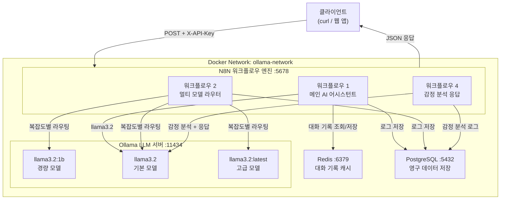
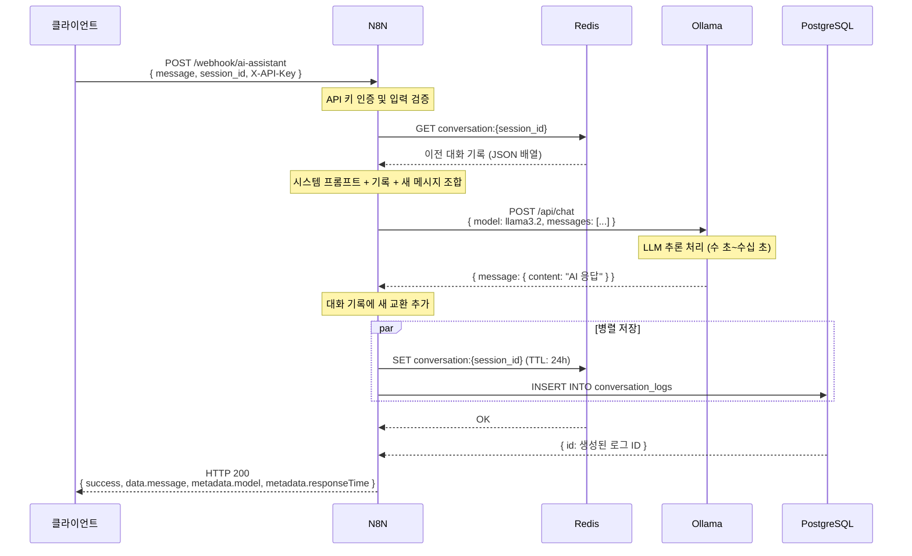
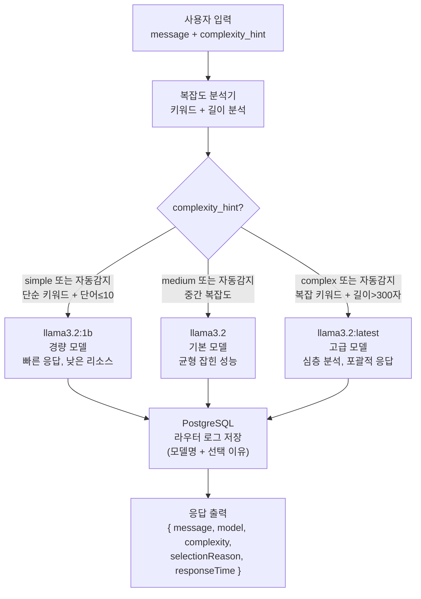
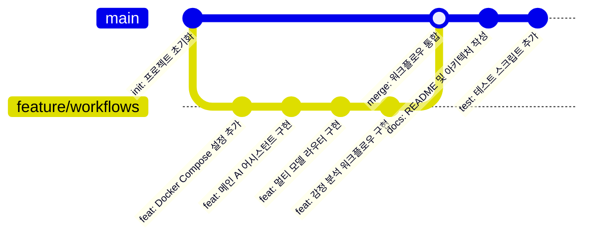

# N8N-Ollama AI 자동화 플랫폼

> Docker 기반 N8N 워크플로우 자동화와 Ollama 로컬 LLM을 통합한 프로덕션 수준의 AI 플랫폼

---

## 목차

1. [프로젝트 개요](#프로젝트-개요)
2. [시스템 아키텍처](#시스템-아키텍처)
3. [설치 및 실행](#설치-및-실행)
4. [워크플로우 사용법](#워크플로우-사용법)
5. [환경 변수 설명](#환경-변수-설명)
6. [N8N 자격증명 설정](#n8n-자격증명-설정)
7. [Git 이력](#git-이력)
8. [문제 해결 가이드](#문제-해결-가이드)

---

## 프로젝트 개요

N8N-Ollama 플랫폼은 세 가지 핵심 AI 워크플로우를 제공합니다.

| 번호 | 워크플로우 이름         | 설명                                           | 엔드포인트            |
|------|------------------------|------------------------------------------------|-----------------------|
| 1    | 메인 AI 어시스턴트      | Redis 대화 기록 + PostgreSQL 로그 + Ollama 대화 | `/webhook/ai-assistant`      |
| 2    | 멀티 모델 라우터        | 메시지 복잡도에 따른 자동 모델 선택 라우팅      | `/webhook/model-router`      |
| 4    | 감정 분석 및 맞춤 응답  | 감정 감지 후 맞춤 톤으로 응답 생성             | `/webhook/sentiment-response` |

### 핵심 특징

- **완전한 Docker 구성**: `docker compose up -d` 한 명령으로 전체 스택 시작
- **API 키 인증**: 모든 웹훅에 `X-API-Key` 헤더로 인가된 요청만 처리
- **세션 관리**: Redis로 대화 기록 유지, 24시간 TTL
- **데이터 영속성**: PostgreSQL에 모든 대화/분석 이력 저장
- **멀티 모델 지원**: llama3.2:1b (경량), llama3.2 (기본), llama3.2:latest (고급)
- **한국어 최적화**: 시스템 프롬프트와 에러 메시지 한국어 지원

---

## 시스템 아키텍처

### 다이어그램 1: 전체 시스템 구성



### 다이어그램 2: 메인 AI 어시스턴트 시퀀스



### 다이어그램 3: 멀티 모델 라우터 흐름



### 다이어그램 4: Git 커밋 이력



---

## 설치 및 실행

### 사전 요구사항

- Docker Engine 24.0 이상
- Docker Compose V2 (`docker compose` 명령)
- 최소 8GB RAM (Ollama LLM 모델 로드 필요)
- 최소 20GB 디스크 여유 공간 (모델 파일 포함)

### 빠른 시작

```bash
# 1. 저장소 클론
git clone https://github.com/your-username/n8n-ollama-platform.git
cd n8n-ollama-platform

# 2. 환경 변수 설정 (필요시 수정)
cp .env .env.local
# .env 파일을 편집하여 비밀번호 등을 변경하세요

# 3. 자동 설치 스크립트 실행
chmod +x scripts/setup.sh
bash scripts/setup.sh

# --- 또는 수동 실행 ---

# 4. Docker 서비스 시작
docker compose up -d

# 5. 서비스 상태 확인
docker compose ps
```

### 서비스 시작 확인

```bash
# 전체 서비스 상태
docker compose ps

# 로그 실시간 확인
docker compose logs -f n8n

# Ollama 모델 목록 확인
docker exec n8n_ollama ollama list

# N8N 헬스체크
curl http://localhost:5678/healthz
```

### Ollama 모델 수동 다운로드

```bash
# 메인 어시스턴트 및 감정 분석용 모델
docker exec n8n_ollama ollama pull llama3.2

# 경량 모델 (라우터 - simple)
docker exec n8n_ollama ollama pull llama3.2:1b

# 고급 모델 (라우터 - complex)
docker exec n8n_ollama ollama pull llama3.2:latest
```

---

## 워크플로우 사용법

### N8N에 워크플로우 가져오기

1. 브라우저에서 `http://localhost:5678` 접속
2. 계정: `admin` / 비밀번호: `admin123!`
3. **Settings → Credentials → New**에서 Redis, PostgreSQL 자격증명 생성
4. **Workflows → Import from file**로 JSON 파일 가져오기
5. 각 워크플로우를 열고 **Active** 토글 활성화

---

### 워크플로우 1: 메인 AI 어시스턴트

대화 기록을 유지하며 Ollama와 대화하는 메인 어시스턴트입니다.

#### 요청 형식

```bash
curl -X POST http://localhost:5678/webhook/ai-assistant \
  -H "Content-Type: application/json" \
  -H "X-API-Key: n8n-ollama-api-key-2024" \
  -d '{
    "message": "안녕하세요! 파이썬과 자바스크립트의 차이점을 알려주세요.",
    "session_id": "user_session_001"
  }'
```

#### 응답 예시

```json
{
  "success": true,
  "requestId": "req_1703123456789_abc123",
  "sessionId": "user_session_001",
  "data": {
    "message": "파이썬과 자바스크립트는 각각 다른 목적으로 설계된 언어입니다...",
    "timestamp": "2024-01-15T09:30:00.000Z"
  },
  "metadata": {
    "model": "llama3.2",
    "responseTime": "4523ms",
    "historySize": 2
  }
}
```

#### 연속 대화 예시

```bash
# 두 번째 메시지 (같은 session_id 사용 → 이전 대화 기억)
curl -X POST http://localhost:5678/webhook/ai-assistant \
  -H "Content-Type: application/json" \
  -H "X-API-Key: n8n-ollama-api-key-2024" \
  -d '{
    "message": "방금 말씀하신 것 중 파이썬의 장점을 더 자세히 설명해주세요.",
    "session_id": "user_session_001"
  }'
```

---

### 워크플로우 2: 멀티 모델 라우터

메시지 복잡도에 따라 최적의 Ollama 모델을 자동으로 선택합니다.

#### 요청 형식

```bash
# 단순 메시지 → llama3.2:1b (빠른 경량 모델)
curl -X POST http://localhost:5678/webhook/model-router \
  -H "Content-Type: application/json" \
  -H "X-API-Key: n8n-ollama-api-key-2024" \
  -d '{
    "message": "안녕!",
    "complexity_hint": "simple"
  }'

# 복잡한 메시지 → llama3.2:latest (고급 모델)
curl -X POST http://localhost:5678/webhook/model-router \
  -H "Content-Type: application/json" \
  -H "X-API-Key: n8n-ollama-api-key-2024" \
  -d '{
    "message": "마이크로서비스 아키텍처의 장단점을 모놀리식 패턴과 비교하여 분석해주세요.",
    "complexity_hint": "complex"
  }'

# 자동 복잡도 감지
curl -X POST http://localhost:5678/webhook/model-router \
  -H "Content-Type: application/json" \
  -H "X-API-Key: n8n-ollama-api-key-2024" \
  -d '{
    "message": "Docker와 가상머신의 차이점은 무엇인가요?",
    "complexity_hint": "auto"
  }'
```

#### 응답 예시

```json
{
  "success": true,
  "requestId": "router_1703123456789_xyz",
  "sessionId": "router_1703123456789",
  "data": {
    "message": "마이크로서비스 아키텍처는...",
    "timestamp": "2024-01-15T09:35:00.000Z"
  },
  "metadata": {
    "model": "llama3.2:latest",
    "complexity": "complex",
    "selectionReason": "복잡 키워드 감지 또는 메시지 길이 초과 (단어: 18, 글자: 42)",
    "responseTime": "8234ms"
  }
}
```

#### 복잡도 기준

| 복잡도   | 모델            | 조건                                        |
|---------|-----------------|---------------------------------------------|
| simple  | llama3.2:1b    | 단순 키워드 포함 AND 단어 수 ≤ 10           |
| medium  | llama3.2        | simple/complex 기준 미해당                  |
| complex | llama3.2:latest | 복잡 키워드 포함 OR 단어 수 > 50 OR 글자 > 300 |

---

### 워크플로우 4: 감정 분석 및 맞춤 응답

사용자 메시지의 감정을 분석하고 적합한 톤으로 응답합니다.

#### 요청 형식

```bash
# 긍정적 메시지 → 열정적 톤으로 응답
curl -X POST http://localhost:5678/webhook/sentiment-response \
  -H "Content-Type: application/json" \
  -H "X-API-Key: n8n-ollama-api-key-2024" \
  -d '{
    "message": "오늘 프로젝트 발표가 정말 잘 됐어요! 교수님도 칭찬해주셨어요!",
    "session_id": "sent_session_001"
  }'

# 부정적 메시지 → 공감적 톤으로 응답
curl -X POST http://localhost:5678/webhook/sentiment-response \
  -H "Content-Type: application/json" \
  -H "X-API-Key: n8n-ollama-api-key-2024" \
  -d '{
    "message": "시험을 망쳤어요. 정말 힘들고 지쳐있어요.",
    "session_id": "sent_session_002"
  }'

# 중립적 메시지 → 정보 제공 톤으로 응답
curl -X POST http://localhost:5678/webhook/sentiment-response \
  -H "Content-Type: application/json" \
  -H "X-API-Key: n8n-ollama-api-key-2024" \
  -d '{
    "message": "내일 서울 날씨는 어떨까요?",
    "session_id": "sent_session_003"
  }'
```

#### 응답 예시

```json
{
  "success": true,
  "requestId": "sent_1703123456789_def",
  "sessionId": "sent_session_001",
  "data": {
    "message": "와! 정말 대단한 소식이네요! 발표가 성공적으로 마무리되었군요...",
    "timestamp": "2024-01-15T09:40:00.000Z"
  },
  "sentiment": {
    "result": "positive",
    "confidence": 0.95,
    "reason": "축하와 기쁨의 표현이 명확하게 드러납니다",
    "emotions": ["기쁨", "자부심", "안도"]
  },
  "metadata": {
    "model": "llama3.2",
    "toneApplied": "열정적 톤",
    "responseTime": "5120ms"
  }
}
```

#### 감정별 응답 톤

| 감정     | 톤 이름    | 특징                                          |
|---------|-----------|-----------------------------------------------|
| positive | 열정적 톤  | 긍정 에너지 공감, 격려, 활기찬 표현           |
| negative | 공감적 톤  | 감정 인정, 지지, 판단 없는 따뜻한 응답        |
| neutral  | 정보 제공 톤 | 객관적, 구조적, 사실 기반 정보 제공          |

---

## 환경 변수 설명

`.env` 파일에서 다음 변수들을 설정합니다.

| 변수명                    | 기본값                          | 설명                                  |
|--------------------------|--------------------------------|---------------------------------------|
| `N8N_HOST`               | `localhost`                    | N8N 서버 호스트                        |
| `N8N_PORT`               | `5678`                         | N8N 서버 포트                          |
| `N8N_ENCRYPTION_KEY`     | _(변경 필요)_                  | N8N 자격증명 암호화 키 (프로덕션 필수 변경) |
| `N8N_BASIC_AUTH_USER`    | `admin`                        | N8N 웹 UI 로그인 계정                  |
| `N8N_BASIC_AUTH_PASSWORD`| `admin123!`                    | N8N 웹 UI 로그인 비밀번호              |
| `API_SECRET_KEY`         | `n8n-ollama-api-key-2024`     | 웹훅 API 인증 키 (반드시 변경)          |
| `OLLAMA_BASE_URL`        | `http://ollama:11434`          | Ollama 서버 내부 URL                   |
| `POSTGRES_DB`            | `n8n_ollama`                   | PostgreSQL 데이터베이스 이름            |
| `POSTGRES_USER`          | `n8n_user`                     | PostgreSQL 사용자 이름                  |
| `POSTGRES_PASSWORD`      | `n8n_secure_password_2024`    | PostgreSQL 비밀번호 (반드시 변경)       |
| `REDIS_PASSWORD`         | `redis_secure_password_2024`  | Redis 인증 비밀번호 (반드시 변경)       |
| `MAX_HISTORY_LENGTH`     | `20`                           | 대화 기록 최대 유지 메시지 수           |
| `SESSION_TTL`            | `86400`                        | 세션 만료 시간 (초, 기본 24시간)        |

> **보안 주의**: 프로덕션 환경에서는 `N8N_ENCRYPTION_KEY`, `API_SECRET_KEY`, `POSTGRES_PASSWORD`, `REDIS_PASSWORD`를 반드시 안전한 값으로 변경하세요.

---

## N8N 자격증명 설정

워크플로우를 가져오기 전에 N8N UI에서 다음 자격증명을 생성해야 합니다.

### Redis 자격증명

**Settings → Credentials → New → Redis** 선택 후:

| 항목     | 값                           |
|--------|------------------------------|
| Host   | `redis`                      |
| Port   | `6379`                       |
| Password | `redis_secure_password_2024` |

### PostgreSQL 자격증명

**Settings → Credentials → New → Postgres** 선택 후:

| 항목     | 값                            |
|--------|-------------------------------|
| Host   | `postgres`                    |
| Port   | `5432`                        |
| Database | `n8n_ollama`                |
| User   | `n8n_user`                    |
| Password | `n8n_secure_password_2024`  |

> **중요**: 자격증명 이름을 각각 `Redis 연결`, `PostgreSQL 연결`로 지정해야 워크플로우와 연동됩니다.

---

## Git 이력

```bash
# Git 저장소 초기화 및 GitHub 푸시
chmod +x scripts/git-setup.sh
bash scripts/git-setup.sh
```

커밋 순서:

```
1. init: 프로젝트 초기화
2. feat: Docker Compose 설정 추가
3. feat: 메인 AI 어시스턴트 워크플로우 구현
4. feat: 멀티 모델 라우터 워크플로우 구현
5. feat: 감정 분석 워크플로우 구현
6. docs: README 및 아키텍처 문서 작성
7. test: 테스트 스크립트 추가
```

---

## 문제 해결 가이드

### 1. N8N이 시작되지 않는 경우

```bash
# 컨테이너 로그 확인
docker compose logs n8n

# PostgreSQL 연결 확인
docker compose logs postgres

# 모든 서비스 재시작
docker compose down && docker compose up -d
```

### 2. Ollama 모델 응답 없음

```bash
# Ollama 컨테이너 상태 확인
docker compose logs ollama

# 설치된 모델 목록 확인
docker exec n8n_ollama ollama list

# 모델 수동 다운로드
docker exec n8n_ollama ollama pull llama3.2
docker exec n8n_ollama ollama pull llama3.2:1b

# Ollama API 직접 테스트
curl http://localhost:11434/api/chat \
  -d '{"model":"llama3.2","messages":[{"role":"user","content":"hello"}],"stream":false}'
```

### 3. Redis 연결 오류

```bash
# Redis 상태 확인
docker compose logs redis

# Redis 직접 연결 테스트
docker exec n8n_redis redis-cli -a redis_secure_password_2024 ping
# 응답: PONG

# 세션 키 목록 확인
docker exec n8n_redis redis-cli -a redis_secure_password_2024 keys "conversation:*"
```

### 4. PostgreSQL 연결 오류

```bash
# PostgreSQL 로그 확인
docker compose logs postgres

# 직접 연결 테스트
docker exec -it n8n_postgres psql -U n8n_user -d n8n_ollama -c "\dt"

# 대화 기록 조회
docker exec -it n8n_postgres psql -U n8n_user -d n8n_ollama \
  -c "SELECT * FROM conversation_logs ORDER BY created_at DESC LIMIT 5;"
```

### 5. API 키 인증 오류 (HTTP 401)

```bash
# .env 파일에서 API 키 확인
grep API_SECRET_KEY .env

# 올바른 API 키로 테스트
curl -X POST http://localhost:5678/webhook/ai-assistant \
  -H "Content-Type: application/json" \
  -H "X-API-Key: n8n-ollama-api-key-2024" \
  -d '{"message": "테스트", "session_id": "test"}'
```

### 6. 워크플로우 활성화 안 됨

1. N8N UI (`http://localhost:5678`) 접속
2. 해당 워크플로우 클릭
3. 오른쪽 상단의 **Inactive** 토글을 클릭하여 **Active**로 변경
4. 자격증명 오류 메시지가 있으면 Credentials 탭에서 수정

### 7. 메모리 부족 (Out of Memory)

```bash
# 컨테이너 메모리 사용량 확인
docker stats

# Ollama 메모리 제한 조정 (docker-compose.yaml)
# ollama 서비스의 deploy.resources.limits.memory 값 수정

# 불필요한 모델 제거
docker exec n8n_ollama ollama rm llama3.2:1b
```

### 8. 전체 테스트 실행

```bash
# 전체 통합 테스트
chmod +x scripts/test-all.sh
bash scripts/test-all.sh

# 단위 테스트 (빠른 smoke test)
chmod +x tests/test_workflows.sh
bash tests/test_workflows.sh
```

---

## 프로젝트 구조

```
n8n-ollama-platform/
├── docker-compose.yaml          # Docker 서비스 구성
├── .env                         # 환경 변수 (Git 제외)
├── .gitignore                   # Git 무시 파일 목록
├── README.md                    # 이 문서
│
├── workflows/                   # N8N 워크플로우 JSON
│   ├── 01_main_ai_assistant.json     # 메인 AI 어시스턴트
│   ├── 02_multi_model_router.json    # 멀티 모델 라우터
│   └── 04_sentiment_analysis.json   # 감정 분석 및 맞춤 응답
│
├── scripts/                     # 운영 스크립트
│   ├── setup.sh                 # 초기 설치 스크립트
│   ├── git-setup.sh             # Git 초기화 및 GitHub 푸시
│   ├── test-all.sh              # 전체 통합 테스트
│   └── init-db.sql              # PostgreSQL 테이블 초기화
│
├── docs/                        # 문서
│   └── architecture.md          # 아키텍처 상세 문서
│
└── tests/                       # 테스트 파일
    └── test_workflows.sh        # 단위 테스트
```

---

## 라이선스

이 프로젝트는 교육 목적으로 작성되었습니다.

---

*N8N-Ollama 플랫폼 — Docker 기반 로컬 AI 자동화 솔루션*
