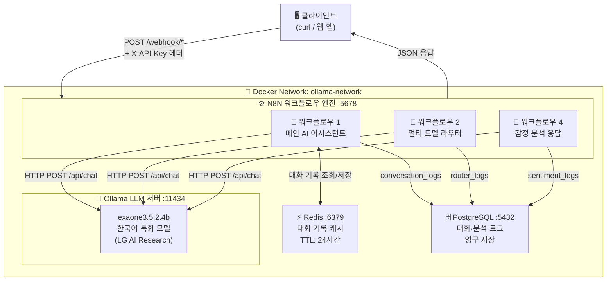
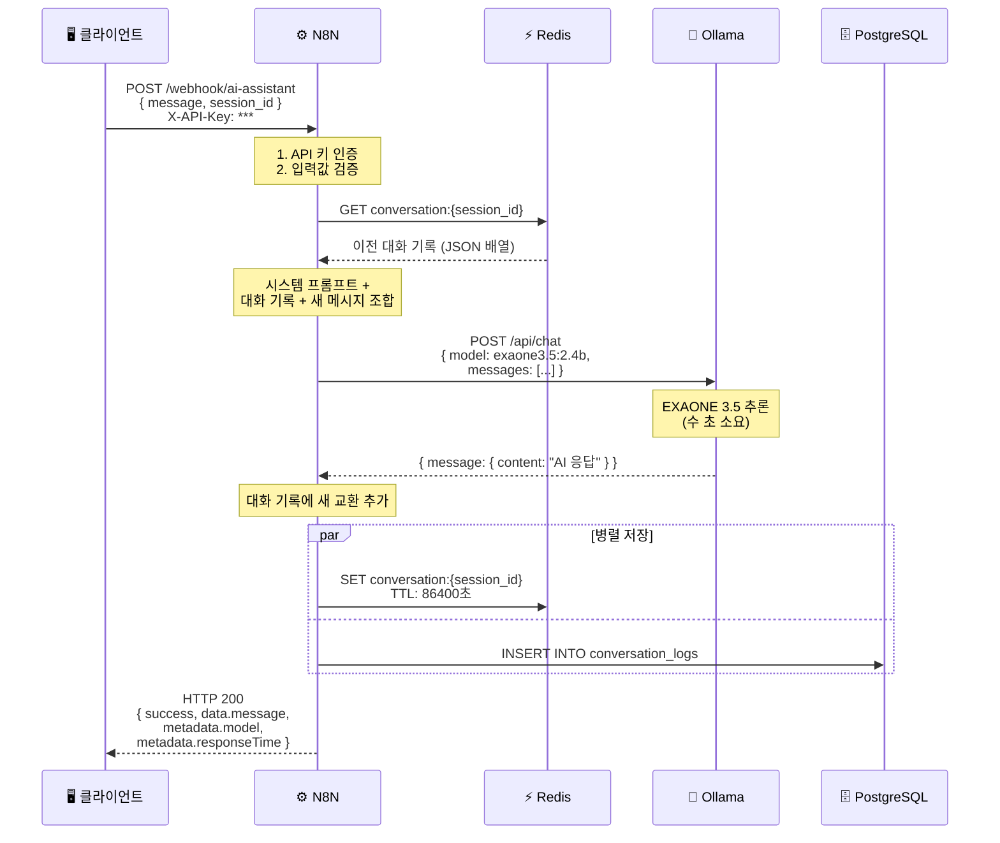
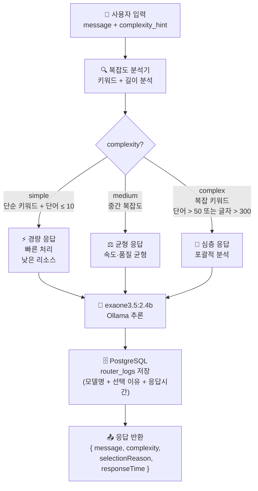
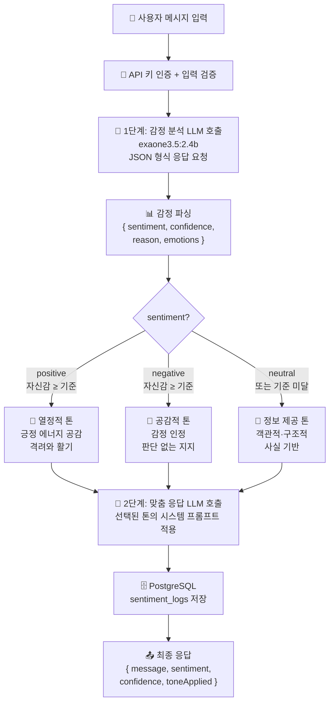
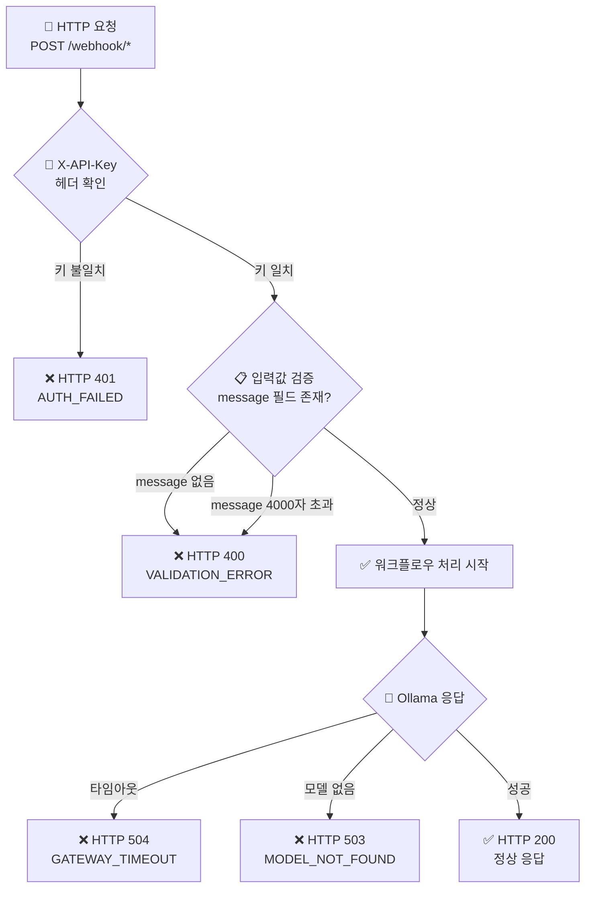
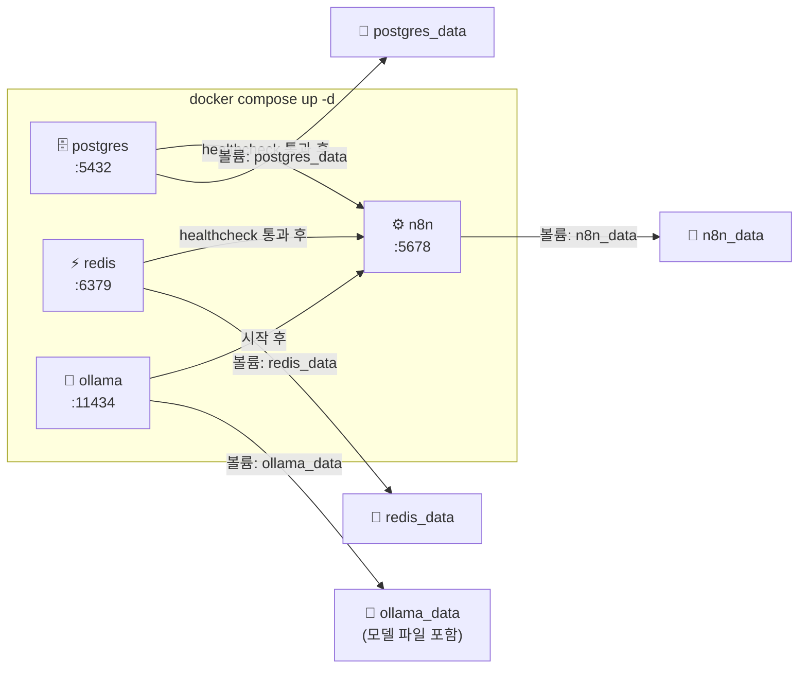

# 시스템 아키텍처 다이어그램

N8N-Ollama 플랫폼의 전체 동작 원리를 한눈에 볼 수 있는 다이어그램 모음입니다.

---

## 다이어그램 1: 전체 시스템 구성

4개 Docker 서비스가 하나의 네트워크에서 동작하는 구성입니다.

---

## 다이어그램 2: 메인 AI 어시스턴트 시퀀스

Redis 대화 기록을 활용한 멀티턴 대화 흐름입니다.

---

## 다이어그램 3: 멀티 모델 라우터 흐름

메시지 복잡도를 자동 감지하여 적합한 응답 전략을 선택합니다.

---

## 다이어그램 4: 감정 분석 워크플로우

2단계 LLM 호출로 감정을 먼저 분석한 후, 맞춤 톤으로 응답합니다.

---

## 다이어그램 5: 인증 및 에러 처리 흐름

모든 워크플로우 공통 보안 레이어입니다.

---

## 다이어그램 6: Docker 서비스 의존성

---

## API 요청/응답 요약

| 엔드포인트 | 필수 헤더 | 요청 바디 | 응답 특이사항 |
|-----------|----------|----------|--------------|
| `/webhook/ai-assistant` | `X-API-Key` | `message`, `session_id` | `historySize` 포함 |
| `/webhook/model-router` | `X-API-Key` | `message`, `complexity_hint` | `complexity`, `selectionReason` 포함 |
| `/webhook/sentiment-response` | `X-API-Key` | `message`, `session_id` | `sentiment`, `confidence`, `toneApplied` 포함 |
